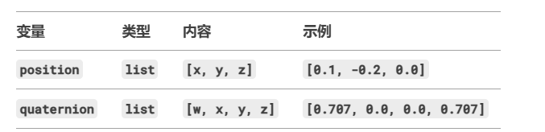

使用flask框架实现机器狗b2和深度相机D445与主机PC之间的数据交换。

## camera.py
这段代码配置了 **Intel RealSense** 相机的深度（Depth）和彩色（Color）数据流。`config.enable_stream()` 方法用于启用特定的数据流，并设置其参数。下面详细解释每个参数的含义：

---

### **1. `rs.stream.depth` 和 `rs.stream.color`**
- **`rs.stream.depth`**  
  表示启用 **深度流**（Depth Stream），即从深度传感器获取的距离信息（单位通常是毫米）。  
- **`rs.stream.color`**  
  表示启用 **彩色流**（Color Stream），即从 RGB 摄像头获取的彩色图像。

---

### **2. `640, 480`（分辨率）**
- **`640`** 表示图像的 **宽度（width）**，单位为像素。  
- **`480`** 表示图像的 **高度（height）**，单位为像素。  
- 这里设置的分辨率是 **640×480**，这是 RealSense 相机支持的常见分辨率之一。  
- 更高的分辨率（如 1280×720）会占用更多计算资源，但可能更适合高精度应用。

---

### **3. `rs.format.z16` 和 `rs.format.bgr8`（数据格式）**
#### **(1) `rs.format.z16`（深度流格式）**
- **`z16`** 表示深度数据以 **16 位无符号整数（uint16）** 存储。  
- 每个像素的值代表该点到相机的距离（单位通常是毫米）。  
- 例如：
  - `0` 表示无效/无数据（如遮挡区域）。
  - `1000` 表示距离相机 1 米。

#### **(2) `rs.format.bgr8`（彩色流格式）**
- **`bgr8`** 表示彩色图像以 **8 位 BGR 格式** 存储。  
- 每个像素由 **3 个通道（Blue、Green、Red）** 组成，每个通道占 8 位（0~255）。  
- OpenCV 默认使用 BGR 格式（而非 RGB），因此这种格式可以直接用于 OpenCV 处理。

---

### **4. `30`（帧率，FPS）**
- **`30`** 表示数据流的帧率为 **30 FPS（Frames Per Second）**。  
- 更高的帧率（如 60 FPS）适合高速运动场景，但会增加计算负载。  
- 更低的帧率（如 15 FPS）适合静态场景，可降低资源占用。

---

### **总结**
| 参数 | 含义 | 深度流（Depth） | 彩色流（Color） |
|------|------|----------------|----------------|
| **数据流类型** | 选择深度或彩色数据 | `rs.stream.depth` | `rs.stream.color` |
| **分辨率** | 图像的宽高（像素） | `640, 480` | `640, 480` |
| **数据格式** | 像素的存储格式 | `rs.format.z16`（16 位深度） | `rs.format.bgr8`（BGR 彩色） |
| **帧率** | 每秒帧数（FPS） | `30` | `30` |

---

### **补充说明**
1. **为什么深度流用 `z16`？**  
   - `z16` 是深度数据的标准格式，直接存储物理距离（毫米级精度），适合后续处理（如点云生成）。

2. **为什么彩色流用 `bgr8`？**  
   - OpenCV 默认使用 BGR 顺序，因此 `bgr8` 格式无需额外转换即可兼容 OpenCV 函数（如 `cv2.imshow`）。

3. **分辨率匹配问题**  
   - 深度和彩色流的分辨率设为相同（640×480），确保两者对齐，便于后续融合（如 RGB-D 处理）。

4. **帧率同步**  
   - 深度和彩色流的帧率均为 30 FPS，可减少时间不同步问题（但实际同步还需硬件支持）。

## b2.py
